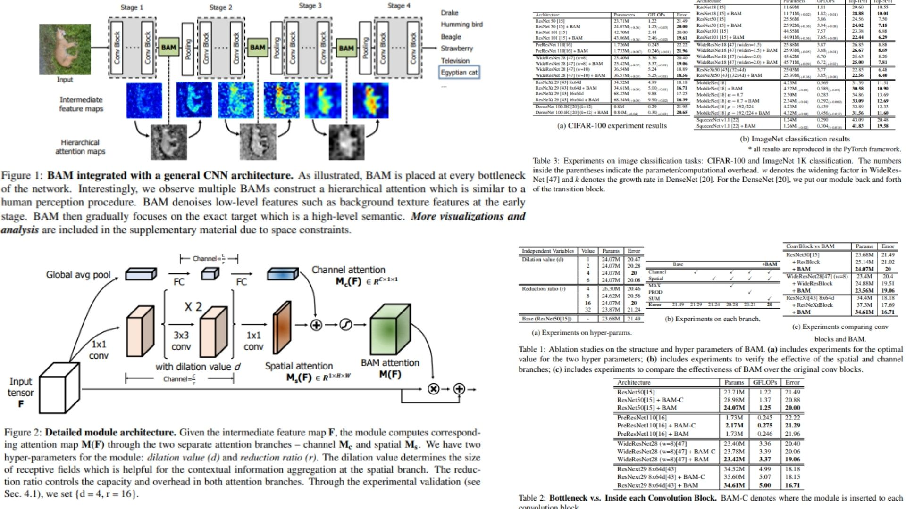

# 🎋 BAM-Replication — Bottleneck Attention Module for CNNs

This repository presents a **faithful PyTorch replication** of the  
**Bottleneck Attention Module (BAM)**, a lightweight attention mechanism designed  
to enhance **representational power** in convolutional neural networks 🝮.

The goal of this project is **conceptual clarity and structural correctness** —  
translating the paper’s **mathematics, block diagram, and design  
directly into clean, modular code, without training or benchmarking.

Key characteristics:
- Dual-path **Channel + Spatial attention** ✶
- **Bottleneck-level integration** for hierarchical attention formation ⟁
- Residual attention formulation for stable gradient flow ⟐
- Minimal parameter and computational overhead ⚖

**Paper reference:**  
[Bottleneck Attention Module (arXiv:1807.06514)](https://arxiv.org/abs/1807.06514) ⧉

---

## ⟁ Overview — Hierarchical Attention at Bottlenecks



> Standard CNNs progressively abstract features but treat all channels  
> and spatial locations uniformly.  
> **BAM introduces selective emphasis**, enabling the network to decide  
> **what** to focus on and **where**, precisely at structural bottlenecks.

High-level intuition:

- Early BAM blocks suppress background textures and noise
- Deeper BAM blocks emphasize semantically meaningful regions
- Multiple BAMs form a **hierarchical attention mechanism**,  
  analogous to coarse-to-fine human visual perception

BAM is inserted **only at bottlenecks** — points where spatial resolution changes —  
maximizing impact while keeping the architecture efficient.

---

## 🧮 Attention Formulation

Given an intermediate feature map

$$
F \in \mathbb{R}^{C \times H \times W},
$$

BAM computes a **3D attention map** by decomposing attention into two independent paths.

### Channel Attention

Channel attention captures **inter-channel dependencies**, answering the question:  
*Which feature detectors are globally important?*

$$
M_c(F) = \text{BN}\bigl(W_1(W_0 \cdot \text{AvgPool}(F) + b_0) + b_1\bigr),
$$

where the channel dimension is reduced by a ratio $$r$$ to control complexity.

### Spatial Attention

Spatial attention focuses on **where** informative features are located,  
leveraging contextual information via dilated convolutions:

$$
M_s(F) = \text{BN}\bigl(f^{1\times1}_3(
f^{3\times3}_2(
f^{3\times3}_1(
f^{1\times1}_0(F)
)))\bigr),
$$

with dilation $$d$$ enlarging the receptive field without pooling.

### Attention Fusion and Residual Refinement

The two attention maps are broadcast and combined:

$$
M(F) = \sigma\bigl(M_c(F) + M_s(F)\bigr),
$$

and applied using a residual formulation:

$$
F' = F + F \odot M(F).
$$

This design ensures **information is reweighted, not destroyed**,  
preserving stable optimization behavior.

---

## ⚙ Architectural Principle

- **Channel attention** models *what* to emphasize
- **Spatial attention** models *where* to emphasize
- **Element-wise summation** ensures smooth gradient flow
- **Residual connection** prevents over-suppression
- Reduction ratio $$r$$ and dilation $$d$$ balance capacity and efficiency

The module is **fully feed-forward**, end-to-end trainable,  
and architecture-agnostic.

---

## 🧩 Repository Structure

```bash
BAM-Replication/
├── src/
│   ├── utils/
│   │   └── visualization.py     
│   │
│   ├── attention/
│   │   ├── channel_attention.py 
│   │   └── spatial_attention.py 
│   │
│   ├── layers/
│   │   └── conv_layers.py      
│   │
│   ├── blocks/
│   │   └── bam_blocks.py       
│   │
│   ├── models/
│   │   └── bam_model.py         
│   │
│   ├── pipeline.py             
│   │
│   └── config.py              
│
├── images/
│   └── figmix.jpg       
│
├── requirements.txt
└── README.md
```
---


## 🔗 Feedback

For questions or feedback, contact: [barkin.adiguzel@gmail.com](mailto:barkin.adiguzel@gmail.com)
